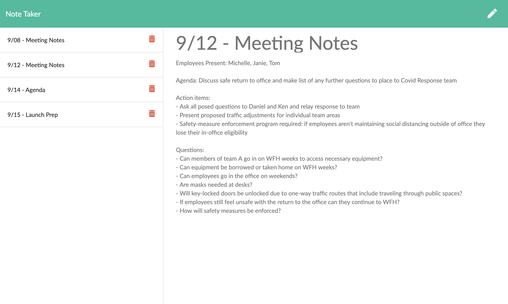

# Note Taker
An application that allows the user to take, save, and delete notes. 



## Functionality 
```
WHEN I visit the application
THEN I am presented with all of my previously saved notes
WHEN I write a new note
THEN I am able to save my note and it is added to my list of saved notes
WHEN I click to delete a note
THEN the note is removed from my saved notes
```

## Credits
This front-end of this application was provided by Trilogy Education Services for the JHU Web Development Bootcamp. It uses
[Express](https://www.npmjs.com/package/express).

## Other Work
You can see some of my other work at <https://github.com/kimcredit>.    

## License
Copyright (c) 2020 Kim Credit.